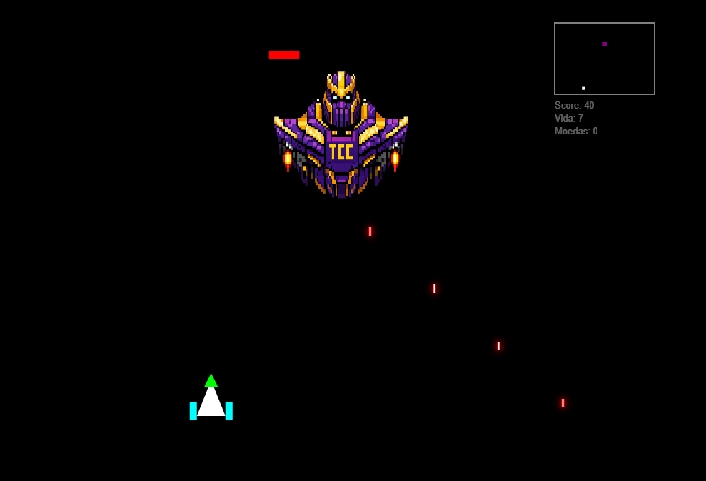

# 🚀 Semester-Blaster

---

## 🎓 Sobre o Projeto

O **Semester-Blaster** é um jogo 2D desenvolvido em **JavaScript puro utilizando a API Canvas**, criado por **Hyan Victor** como projeto da disciplina de **Computação Gráfica**.

O jogo representa, de forma criativa, a jornada acadêmica de um estudante, onde cada inimigo simboliza uma disciplina e o objetivo é sobreviver aos semestres até enfrentar o maior desafio:

💀 **O temido TCC.**

---

## 🎮 Gameplay

* Controle uma nave espacial
* Derrote inimigos (disciplinas)
* Colete moedas
* Evolua sua nave
* Enfrente o boss final (TCC)

---

## 🎯 Controles

| Ação   | Tecla  |
| ------ | ------ |
| Mover  | ← →    |
| Atirar | Espaço |

---

## ⚙️ Funcionalidades

* Sistema de fases progressivas
* Boss com barra de vida
* Sistema de upgrade de nave
* Seleção de dificuldade (Fácil / Médio / Difícil)
* Minimap em tempo real
* Interface com menu, loja e informações
* Sistema de moedas e progressão

---

## 🧠 Conceitos de Computação Gráfica

O projeto implementa diversos conceitos fundamentais:

### ✅ Implementados

* ✔️ **Set Pixel**

  * Manipulação direta de pixels com `ImageData`

* ✔️ **Rasterização de Linhas**

  * Implementação manual de linhas (estilo Bresenham)

* ✔️ **Preenchimento de Regiões**

  * Algoritmo Flood Fill

* ✔️ **Transformações Geométricas**

  * Translação (`translate`)
  * Escala (`scale`)

* ✔️ **Animação 2D**

  * Loop com `requestAnimationFrame`

* ✔️ **Janela e Viewport**

  * Conversão de coordenadas com `worldToViewport`

* ✔️ **Clipping**

  * Algoritmo de Cohen-Sutherland

* ✔️ **Mapeamento de Textura**

  * Aplicação de textura no fundo do jogo (`space.png`)

* ✔️ **Input**

  * Controle via teclado

* ✔️ **Interface Gráfica**

  * Menu inicial
  * Loja de naves
  * Sistema de dificuldade

---

## 🧩 Estrutura do Projeto

### 📄 `index.html`

* Interface do jogo
* Menu, loja e HUD

### 📄 `script.js`

* Lógica completa do jogo:

  * Renderização
  * Física e colisão
  * Sistema de fases
  * Input
  * IA dos inimigos

---

## 🎨 Assets

* `gameshow.png` → imagem de apresentação
* `space.png` → fundo do jogo
* `Thanos.png` → boss final
* `nave*.png` → naves do jogador

---

## 🚀 Tecnologias Utilizadas

* HTML5
* CSS3
* JavaScript (Vanilla)
* Canvas API

---

## 📈 Possíveis Melhorias

* Implementar rasterização de círculo/elipse
* Adicionar rotação nas entidades
* Sistema de seleção de nave no menu
* Efeitos visuais avançados (partículas, glow)
* Sistema de áudio
* Persistência com `localStorage`

---

## 👨‍💻 Autores

**Hyan Victor**
**Yasmin**

Projeto desenvolvido para fins acadêmicos na disciplina de **Computação Gráfica**.

---

## 🏁 Conclusão

O projeto demonstra, de forma prática, a aplicação de conceitos fundamentais de Computação Gráfica em um ambiente interativo, combinando teoria e implementação em um jogo funcional.

---
